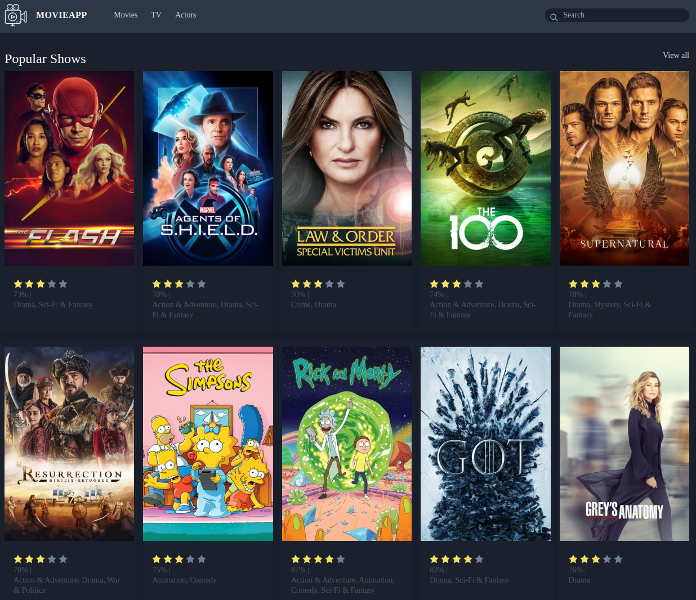
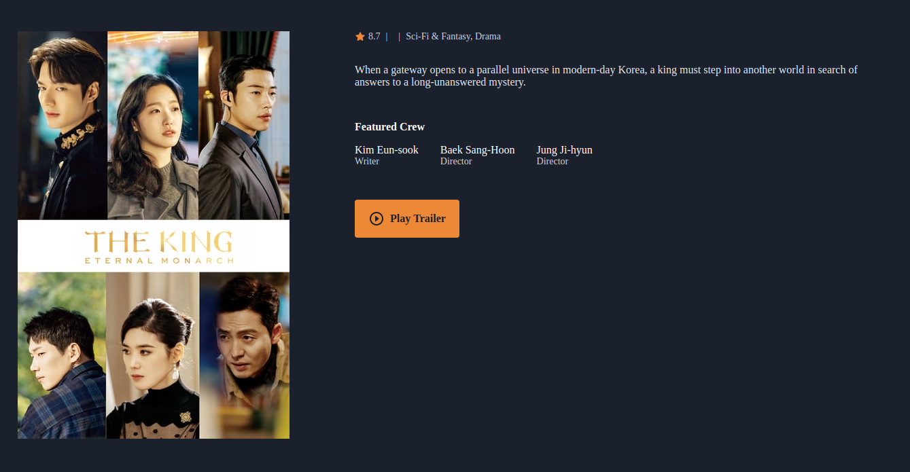

# Vue Movie app
Technical Test of recruitment process at Dreamaxtion Ltd. 
This vue application functionality to display Movies, TV Shows and the details.

# Features

- List Popular and Now Playing Movies
- View Movie Details
- List Popular and Top Rated Tv Shows
- View Tv Show Details
- Shows popular Actors with Infinite Scroll
- Search Everything

## Installation

- Clone the repo
- cd movieapp
- cp env.example .env
- Register and get you auth key from [TMDb](https://www.themoviedb.org/documentation/api)
- Set up auth key in .env file
- npm install
- npm run serve
- visit localhost:8080 in browser

### API and Data source
[TMDb](https://www.themoviedb.org/documentation/api)

# Captures
Tv Shows Page

Show Detail
